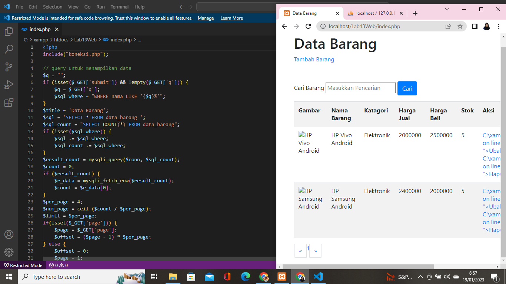

# Lab13Web

## Membuat Pagination
Pagination digunakan untuk membatasi atau membagi record data yang akan ditampilkan pada
laman web. Dari seluruh record data yang ada akan dibagi berdasarkan jumlah record
per-halaman. Pada prinsipnya untuk membatasi tampilan record data pada query mysql menggunakan LIMIT dan OFFSET
